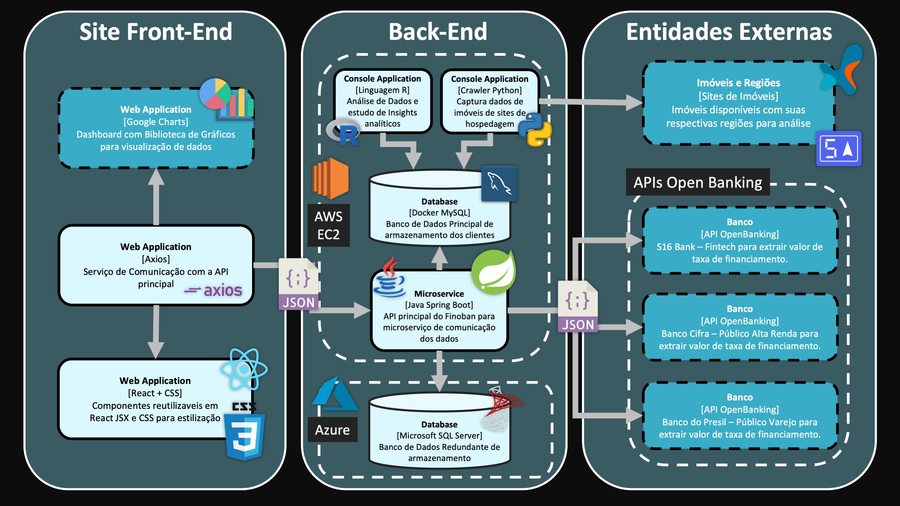
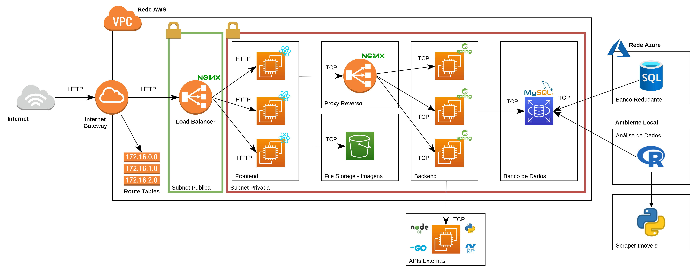

<h1 align="left">
    🔗 Finoban - Financing Open Banking
</h1>

<p align="left">🚀 Projeto com foco em aprimorar a experiência com financiamentos imobiliários</p>

Grupo 09 - 3CCOA

## Contextualização
TBD

## Arquitetura

### V1

<p align="center">
  
</p>

### V2

<p align="center">
  
</p>


## Instalação

### Dependências

* java
* maven
* nodejs
* npm
* python 3
* pip
* .NET Core
* Golang
* Docker
* MySQL
* R
  
<br>

### Backend

```
  sudo apt install maven
  cd api-finoban/finoban/
  mvn spring-boot:run
```

### Para visualizar a documentação da API

```ruby
url: "http://localhost:8080/swagger-ui.html"
```

### Frontend

```
  sudo apt install nodejs npm
  cd frontend/site-react/
  npm i
  npm start
```

### Scraper

```
  cd crawler/
  pip3 install -r requirements.txt
  python3 main.py
```

### APIs externas

#### Instalando Dependências

```
  cd scripts_shell/install/
  source ./apis.sh
```

#### <b>API Serasa:</b> Golang

```
  cd scripts_shell/start/apis/
  source ./iniciar_serasa.sh
```

#### <b>API S16 Bank:</b> Python Flask

```
  cd scripts_shell/start/apis/
  source ./iniciar_s16.sh
```

#### <b>API Banco Cifra:</b> .NET Core

```
  cd scripts_shell/start/apis/
  source ./iniciar_cifra.sh
```

#### <b>API Banco do Presil:</b> Nodejs

```
  cd scripts_shell/start/apis/
  source ./iniciar_presil.sh
```

### Inserir dados em massa - para MySQL

```
  cd banco_de_dados/inserir-em-massa/
  pip3 install -r requirements.txt
  python3 script.py
```

## Integrantes

* Catarina Carneiro
* Felipe Azevedo
* José Silva
* Mario Heleno
* Victor Barbosa
* Vinícius Carvalho

<!-- <h2>
  Algumas das tecnologias que mais utilizamos
</h2>

</img>

</img>

</img> -->
