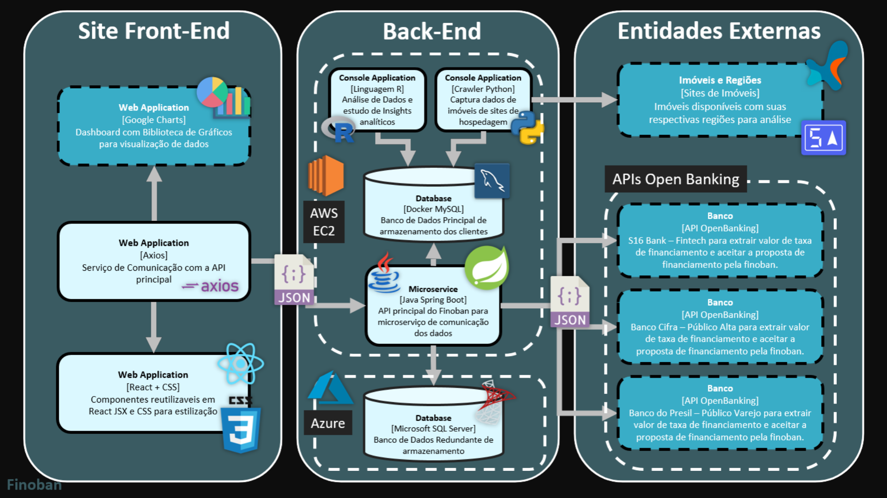

<h1 align="left">
    🔗 Finoban - Financing Open Banking
</h1>

🚀 Projeto que vai abalar sua experiência com financiamento imobiliar

Grupo 09 - 3CCOA

## Contextualização
TBD

## Arquitetura

  

## Instalação
TBD

## Integrantes

* Catarina Carneiro
* Felipe Azevedo
* José Silva
* Mario Heleno
* Victor Barbosa
* Vinícius Carvalho

<h2>
  Algumas das tecnologias que mais utilizamos
</h2>

</img>

</img>

</img>
